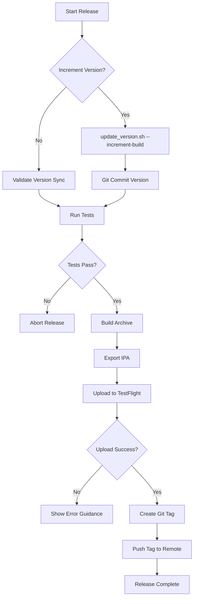
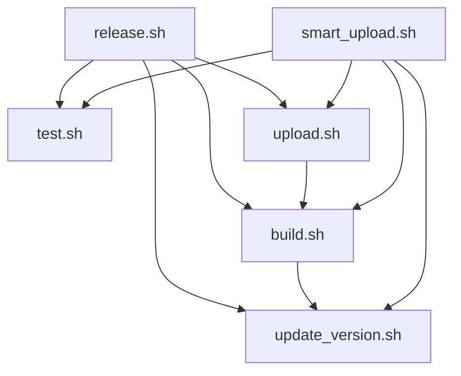
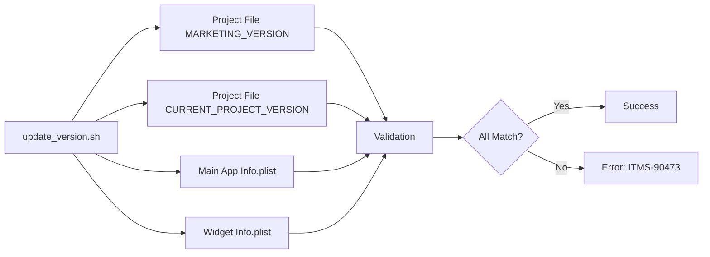

# InOfficeDaysTracker - Complete Project Analysis

**Analysis Date:** June 12, 2026  
**Analyst:** Roo (Architect Mode)  
**Project Version:** 1.x (iOS 17.0+)

---

## Executive Summary

InOfficeDaysTracker is a **privacy-first iOS application** that automatically tracks office presence using geofencing technology to help hybrid workers meet their in-office day requirements. The project demonstrates mature iOS development practices with comprehensive automation, robust testing, and Apple guidelines compliance.

### Key Highlights
- **Privacy-First Architecture**: All data stored locally, no cloud sync, no external servers
- **Automated CI/CD Pipeline**: Complete TestFlight deployment automation via custom scripts and Fastlane
- **Production-Ready**: Comprehensive test suite, version synchronization, and error handling
- **Apple Guidelines Compliant**: Follows HIG, location services best practices, and progressive permissions
- **Widget Support**: Lock screen widgets (iOS 16+) with battery-optimized updates

---

## 1. Project Architecture

### 1.1 Technology Stack

| Component | Technology | Version |
|-----------|-----------|---------|
| **Platform** | iOS | 17.0+ |
| **Language** | Swift | 5.9+ |
| **UI Framework** | SwiftUI | 5.0+ |
| **Architecture** | MVVM | - |
| **Build System** | Xcode | 15.0+ |
| **Dependency Manager** | Swift Package Manager | - |
| **CI/CD** | Custom Scripts + Fastlane | - |

### 1.2 Project Structure

```
InOfficeDaysTracker/
├── 📱 Main App
│   ├── InOfficeDaysTrackerApp.swift      # App entry point with WhatsNewKit
│   ├── ContentView.swift                  # Root view
│   └── Info.plist                         # App configuration
│
├── 📊 Models (Data Layer)
│   ├── AppData.swift                      # Main observable object (1370 lines)
│   ├── AppSettings.swift                  # User preferences
│   ├── OfficeVisit.swift                  # Visit data structure
│   ├── CompanyPolicy.swift                # Hybrid work policies
│   ├── HolidayCalendar.swift              # Holiday calculations
│   ├── OfficeLocation.swift               # Multi-location support
│   ├── CalendarSettings.swift             # Calendar integration config
│   └── GoalCalculationBreakdown.swift     # Goal calculation details
│
├── 🔧 Services (Business Logic)
│   ├── LocationService.swift              # Core Location & geofencing (1166 lines)
│   ├── LocationVerificationService.swift  # Intermittent status fixes
│   ├── NotificationService.swift          # Local notifications
│   ├── CalendarService.swift              # Calendar integration
│   ├── CalendarEventManager.swift         # Event CRUD operations
│   ├── CalendarPermissionHandler.swift    # Permission management
│   ├── EventStoreAdapter.swift            # Calendar abstraction
│   ├── EventStorePool.swift               # Resource pooling
│   └── AddressAutocompleteService.swift   # Location search
│
├── 🎨 Views (Presentation Layer)
│   ├── SetupView.swift                    # 7-step onboarding
│   ├── MainTabView.swift                  # Tab navigation
│   ├── MainProgressView.swift             # Dashboard
│   ├── HistoryView.swift                  # Visit history
│   ├── SettingsView.swift                 # Configuration
│   ├── PolicySettingsView.swift           # Goal & policy settings
│   ├── HolidaySettingsView.swift          # Holiday configuration
│   ├── OfficeLocationsView.swift          # Multi-office management
│   └── CalendarSettingsView.swift         # Calendar integration UI
│
├── 🧩 Components (Reusable UI)
│   ├── MacroRingCard.swift                # Progress ring
│   ├── MiniMetricCard.swift               # Metric display
│   ├── RecentVisitsList.swift             # Visit list
│   └── TrendChartCard.swift               # Trend visualization
│
├── 🎨 Theme (Design System)
│   ├── DesignTokens.swift                 # Colors, spacing, etc.
│   ├── Typography.swift                   # Text styles
│   └── CardStyle.swift                    # Card components
│
├── 📱 Widget Extension
│   ├── OfficeTrackerWidget.swift          # Widget definitions
│   ├── OfficeTrackerWidgetBundle.swift    # Widget bundle
│   ├── SmallWidgetView.swift              # Small widget
│   ├── MediumWidgetView.swift             # Medium widget
│   ├── LargeWidgetView.swift              # Large widget
│   ├── AccessoryCircularView.swift        # Lock screen circular
│   ├── AccessoryRectangularView.swift     # Lock screen rectangular
│   ├── AccessoryInlineView.swift          # Lock screen inline
│   ├── WidgetData.swift                   # Widget data model
│   └── WidgetDataManager.swift            # Widget data sync
│
└── 🧪 Tests
    ├── InOfficeDaysTrackerTests/          # Unit tests (17 test files)
    └── InOfficeDaysTrackerUITests/        # UI tests
```

---

## 2. Automation & CI/CD Pipeline

### 2.1 Custom Scripts Architecture

The project features a **sophisticated automation pipeline** with 8 custom bash scripts:

#### **Core Scripts**

| Script | Purpose | Key Features |
|--------|---------|--------------|
| [`test.sh`](../scripts/test.sh) | Run unit tests | Serial execution, simulator-only, validates release build |
| [`build.sh`](../scripts/build.sh) | Create archive & IPA | Version validation, clean builds, export for TestFlight |
| [`upload.sh`](../scripts/upload.sh) | Upload to TestFlight | Smart error detection, automatic retry suggestions |
| [`release.sh`](../scripts/release.sh) | Full pipeline | Orchestrates test → build → upload → git tag |

#### **Utility Scripts**

| Script | Purpose | Key Features |
|--------|---------|--------------|
| [`update_version.sh`](../scripts/update_version.sh) | Version synchronization | Prevents ITMS-90473 errors, syncs all targets |
| [`smart_upload.sh`](../scripts/smart_upload.sh) | Auto-retry upload | Handles build number collisions automatically |
| [`setup.sh`](../scripts/setup.sh) | Project setup | Initial configuration |
| [`pre-commit.sh`](../scripts/pre-commit.sh) | Git hook | SwiftLint validation |

### 2.2 Release Workflow



### 2.3 Version Management

**Critical Feature**: Automatic version synchronization across all targets to prevent Apple's ITMS-90473 error.

**Synchronized Targets:**
1. Project file `MARKETING_VERSION` (all targets)
2. Project file `CURRENT_PROJECT_VERSION` (all targets)
3. Main app [`Info.plist`](../InOfficeDaysTracker/Info.plist)
4. Widget extension [`Info.plist`](../OfficeTrackerWidget/Info.plist)

**Commands:**
```bash
# Validate synchronization
./scripts/update_version.sh --validate

# Increment build number (1.10.0 build 82 → 1.10.0 build 83)
./scripts/update_version.sh --increment-build

# Increment version (1.10.0 → 1.11.0, build → 1)
./scripts/update_version.sh --increment-version

# Set specific version
./scripts/update_version.sh 1.10.0 85
```

### 2.4 VS Code Integration

**Task Runner**: 13 predefined tasks accessible via `Cmd+Shift+P` → "Tasks: Run Task"

**Key Tasks:**
- 🧪 Run Tests
- 🔨 Build Archive
- ☁️ Upload to TestFlight
- 🚀 Full Release Pipeline
- 📈 Release with Version Increment
- 🔄 Validate Version Sync
- 🔢 Increment Build Number
- 🤖 Smart Upload (Auto-retry)

### 2.5 Fastlane Integration

**Fastfile Lanes:**

| Lane | Purpose | Features |
|------|---------|----------|
| `release_app_store` | Full App Store release | Tests → Build → Upload → Submit for review |
| `deploy_testflight` | TestFlight deployment | Tests → Build → Upload (no submission) |
| `submit_for_review` | Submit existing build | Uses existing TestFlight build |
| `upload_and_submit` | Upload to existing version | Adds binary to existing App Store version |

**Configuration:**
- API Key authentication (no password needed)
- Team ID: `5G586TFR2Y`
- Automatic provisioning updates
- Parallel testing disabled for reliability

---

## 3. Core Features & Implementation

### 3.1 Geofencing & Location Services

**Implementation**: [`LocationService.swift`](../InOfficeDaysTracker/Services/LocationService.swift) (1166 lines)

**Key Features:**
- **Progressive Permissions**: "When in Use" → "Always" following Apple guidelines
- **Exit Grace Period**: 5-minute grace period to prevent false exits from GPS drift
- **Minimum Away Duration**: 3-minute minimum to confirm user actually left
- **Background Monitoring**: Continues tracking when app is closed
- **Battery Optimization**: Uses significant location changes, pauses when not needed
- **Verification Service**: [`LocationVerificationService.swift`](../InOfficeDaysTracker/Services/LocationVerificationService.swift) handles intermittent status issues

**Geofencing Configuration:**
- Configurable radius: 500m - 5km
- Multiple office locations supported (up to 2)
- iOS region monitoring limit: 20 regions
- Accuracy: `kCLLocationAccuracyHundredMeters`

### 3.2 Data Management

**Implementation**: [`AppData.swift`](../InOfficeDaysTracker/Models/AppData.swift) (1370 lines)

**Storage Strategy:**
- **App Groups**: `group.com.lpineda.InOfficeDaysTracker` for widget access
- **UserDefaults**: Local persistence, no Core Data
- **Migration**: Automatic migration from standard UserDefaults to App Groups
- **Data Models**: Codable for JSON serialization

**Key Features:**
- Visit validation (minimum 1-hour duration)
- Duplicate entry prevention
- Historical session repair
- Current visit consistency validation
- Widget data synchronization

### 3.3 Smart Goal Calculation (v1.9.0)

**Features:**
- **Auto-Calculate Mode**: Calculates required days based on company policy
- **Hybrid Policies**: 40%, 50%, 60% hybrid, full office, or full remote
- **Holiday Calendar**: Built-in US holiday presets (NYSE, Federal)
- **PTO & Sick Days**: Mark time off, goals adjust automatically
- **Working Days Calculation**: Excludes weekends and holidays

**Implementation:**
- [`CompanyPolicy.swift`](../InOfficeDaysTracker/Models/CompanyPolicy.swift)
- [`HolidayCalendar.swift`](../InOfficeDaysTracker/Models/HolidayCalendar.swift)
- [`GoalCalculationBreakdown.swift`](../InOfficeDaysTracker/Models/GoalCalculationBreakdown.swift)

### 3.4 Calendar Integration

**Implementation:**
- [`CalendarService.swift`](../InOfficeDaysTracker/Services/CalendarService.swift)
- [`CalendarEventManager.swift`](../InOfficeDaysTracker/Services/CalendarEventManager.swift)
- [`EventStoreAdapter.swift`](../InOfficeDaysTracker/Services/EventStoreAdapter.swift)
- [`EventStorePool.swift`](../InOfficeDaysTracker/Services/EventStorePool.swift)

**Features:**
- Automatic event creation for office visits
- Event updates when visit ends
- Calendar selection UI
- Permission handling
- Resource pooling for EventStore instances

### 3.5 Widget Support (iOS 16+)

**Widget Types:**
1. **Home Screen Widgets**
   - Small: Circular progress ring
   - Medium: Progress + metrics
   - Large: Detailed stats + recent visits

2. **Lock Screen Widgets**
   - Circular: Ring with percentage
   - Rectangular: Detailed status
   - Inline: Single-line with emoji

**Implementation:**
- [`OfficeTrackerWidget/`](../OfficeTrackerWidget/) directory
- Shared data via App Groups
- Battery-optimized updates
- [`WidgetDataManager.swift`](../OfficeTrackerWidget/WidgetDataManager.swift) for data sync

### 3.6 What's New Feature

**Implementation:**
- WhatsNewKit integration
- [`WhatsNewConfiguration.swift`](../InOfficeDaysTracker/WhatsNewConfiguration.swift)
- [`WhatsNewStyling.swift`](../InOfficeDaysTracker/WhatsNewStyling.swift)
- Automatic presentation on version updates
- Custom styling matching app design

---

## 4. Testing Strategy

### 4.1 Test Suite

**17 Test Files** covering:

| Test File | Coverage |
|-----------|----------|
| [`AppDataTests.swift`](../InOfficeDaysTrackerTests/AppDataTests.swift) | Core data operations |
| [`LocationServiceTests.swift`](../InOfficeDaysTrackerTests/LocationServiceTests.swift) | Location tracking |
| [`ProgressCalculationTests.swift`](../InOfficeDaysTrackerTests/ProgressCalculationTests.swift) | Goal calculations |
| [`AutoCalculateGoalTests.swift`](../InOfficeDaysTrackerTests/AutoCalculateGoalTests.swift) | Auto-calculate mode |
| [`CalendarIntegrationTests.swift`](../InOfficeDaysTrackerTests/CalendarIntegrationTests.swift) | Calendar features |
| [`GeofencingStateTests.swift`](../InOfficeDaysTrackerTests/GeofencingStateTests.swift) | Geofencing logic |
| [`ExitGracePeriodTests.swift`](../InOfficeDaysTrackerTests/ExitGracePeriodTests.swift) | Exit grace period |
| [`HistoricalSessionRepairTests.swift`](../InOfficeDaysTrackerTests/HistoricalSessionRepairTests.swift) | Session repair |
| [`WidgetRefreshTests.swift`](../InOfficeDaysTrackerTests/WidgetRefreshTests.swift) | Widget updates |
| [`NotificationTests.swift`](../InOfficeDaysTrackerTests/NotificationTests.swift) | Notifications |
| [`PTOManagementTests.swift`](../InOfficeDaysTrackerTests/PTOManagementTests.swift) | PTO tracking |
| + 6 more test files | Various features |

### 4.2 Test Execution

**Configuration:**
- Serial execution (no parallel testing)
- Simulator-only (iPhone 16, iOS 18.6)
- Isolated DerivedData path
- 60-second destination timeout
- Specific test bundle targeting

**Commands:**
```bash
# Run all tests
./scripts/test.sh

# Run specific test
xcodebuild test -scheme InOfficeDaysTracker \
  -only-testing:InOfficeDaysTrackerTests/WidgetRefreshTests
```

### 4.3 Code Quality

**SwiftLint Integration:**
- Configuration: [`.swiftlint.yml`](../.swiftlint.yml)
- Pre-commit hook available
- VS Code integration via Swift extension
- Installation: `brew install swiftlint`

---

## 5. Privacy & Security

### 5.1 Privacy-First Design

**Core Principles:**
- ✅ **Local Storage Only**: No external servers or cloud sync
- ✅ **No Accounts**: No sign-up, login, or personal information
- ✅ **No Analytics**: No user behavior tracking
- ✅ **No Data Transmission**: All processing on-device
- ✅ **Minimal Permissions**: Only location and notifications

### 5.2 Location Services Compliance

**Apple Guidelines Followed:**
- Progressive permission requests (When in Use → Always)
- Clear purpose descriptions in Info.plist
- Contextual permission requests
- Graceful degradation with limited permissions
- Transparent explanations for users

**Info.plist Keys:**
```xml
<key>NSLocationWhenInUseUsageDescription</key>
<string>This app needs location access to detect when you arrive at your office.</string>

<key>NSLocationAlwaysAndWhenInUseUsageDescription</key>
<string>This app needs always-on location access to automatically track your office visits in the background.</string>

<key>UIBackgroundModes</key>
<array>
    <string>location</string>
</array>
```

### 5.3 Export Compliance

**Encryption Declaration:**
- `ITSAppUsesNonExemptEncryption` set to `false`
- Only uses standard iOS encryption (location services, UserDefaults, Keychain)
- No custom or proprietary encryption algorithms
- Automatically answers Apple's export compliance questions

---

## 6. Documentation

### 6.1 Active Documentation

**Location**: [`docs/guides/`](../docs/guides/)

| Document | Purpose |
|----------|---------|
| [`AUTOMATION.md`](../docs/guides/AUTOMATION.md) | Complete CI/CD guide |
| [`PRD.md`](../docs/guides/PRD.md) | Product requirements |
| [`WIDGET_INTEGRATION_GUIDE.md`](../docs/guides/WIDGET_INTEGRATION_GUIDE.md) | Widget implementation |
| [`WHATSNEWKIT_SETUP_GUIDE.md`](../docs/guides/WHATSNEWKIT_SETUP_GUIDE.md) | What's New setup |
| [`README.md`](../docs/guides/README.md) | Documentation index |

### 6.2 Historical Documentation

**Location**: [`docs/archive/`](../docs/archive/)

**24 archived documents** covering:
- Implementation summaries
- Bug fix reports
- Feature completion reports
- Test status updates
- Deployment plans
- Performance analyses

### 6.3 Project README

**Location**: [`README.md`](../README.md)

**Comprehensive coverage:**
- Feature overview
- Installation instructions
- Architecture documentation
- Apple guidelines compliance
- Privacy & security details
- Testing instructions
- Contributing guidelines

---

## 7. Key Technical Decisions

### 7.1 Architecture Choices

| Decision | Rationale |
|----------|-----------|
| **SwiftUI over UIKit** | Modern declarative UI, better for iOS 17+ |
| **MVVM Pattern** | Clean separation of concerns |
| **UserDefaults over Core Data** | Simpler persistence for small dataset |
| **Local-only storage** | Privacy-first, no external dependencies |
| **App Groups** | Widget data sharing |
| **Swift Package Manager** | Native dependency management |

### 7.2 Automation Choices

| Decision | Rationale |
|----------|-----------|
| **Custom scripts over pure Fastlane** | More control, easier debugging |
| **Bash scripts** | Cross-platform, no dependencies |
| **Version synchronization script** | Prevents ITMS-90473 errors |
| **VS Code tasks** | Developer-friendly interface |
| **Git tagging** | Release tracking |

### 7.3 Testing Choices

| Decision | Rationale |
|----------|-----------|
| **Serial test execution** | Prevents UserDefaults race conditions |
| **Simulator-only** | Faster, more reliable |
| **Isolated DerivedData** | Clean test environment |
| **Mock EventStore** | Calendar testing without permissions |

---

## 8. Development Workflow

### 8.1 Standard Development Flow

```bash
# 1. Create feature branch
git checkout -b feature/new-feature

# 2. Make changes and test
./scripts/test.sh

# 3. Commit changes
git add -A
git commit -m "Add new feature"

# 4. Merge to main
git checkout main
git merge feature/new-feature

# 5. Release from main
./scripts/release.sh --increment
```

### 8.2 Release Best Practices

**✅ Always Release from Main Branch**
- Main reflects production
- Clean history
- Proper tagging
- No divergence

**❌ Don't Release from Feature Branches**
- Creates version mismatches
- Confuses git history
- Tags point to wrong commits

### 8.3 Common Commands

```bash
# Testing
./scripts/test.sh

# Build only
./scripts/build.sh

# Upload existing build
./scripts/upload.sh

# Full pipeline (current version)
./scripts/release.sh

# Full pipeline (increment build)
./scripts/release.sh --increment

# Full pipeline (increment version)
./scripts/release.sh --increment-version

# Skip tests (not recommended)
./scripts/release.sh --skip-tests

# Version management
./scripts/update_version.sh --validate
./scripts/update_version.sh --increment-build
./scripts/update_version.sh --increment-version
./scripts/update_version.sh 1.10.0 85

# Smart upload with auto-retry
./scripts/smart_upload.sh
```

---

## 9. Project Maturity Indicators

### 9.1 Production Readiness

✅ **Comprehensive Testing**: 17 test files, serial execution, isolated environment  
✅ **Automated CI/CD**: Complete pipeline from test to TestFlight  
✅ **Version Management**: Automatic synchronization prevents Apple errors  
✅ **Error Handling**: Robust error detection and recovery  
✅ **Documentation**: Extensive guides and inline documentation  
✅ **Code Quality**: SwiftLint integration, pre-commit hooks  
✅ **Apple Compliance**: Follows HIG, location services best practices  
✅ **Privacy-First**: Local storage, no external dependencies  

### 9.2 Code Quality Metrics

- **Main App**: ~1,370 lines in AppData.swift (well-structured)
- **Location Service**: ~1,166 lines (comprehensive geofencing)
- **Test Coverage**: 17 test files covering core functionality
- **Documentation**: 24 archived docs + 5 active guides
- **Scripts**: 8 automation scripts with error handling
- **Widget Support**: 8 widget views (home + lock screen)

### 9.3 Maintenance Indicators

✅ **Active Development**: Recent commits, ongoing improvements  
✅ **Issue Tracking**: Historical bug fixes documented  
✅ **Version Control**: Proper git workflow, tagged releases  
✅ **Dependency Management**: Swift Package Manager, minimal dependencies  
✅ **Backward Compatibility**: iOS 17.0+ support  

---

## 10. Potential Areas for Enhancement

### 10.1 Future Features (from PRD)

- [ ] Multiple office locations (partially implemented - supports 2)
- [ ] Export data functionality
- [ ] Advanced analytics
- [ ] Apple Watch companion app
- [ ] iCloud sync (optional, privacy-preserving)

### 10.2 Technical Improvements

- [ ] Core Data migration for larger datasets
- [ ] Background task optimization
- [ ] Widget timeline optimization
- [ ] Accessibility enhancements
- [ ] Localization support
- [ ] Dark mode refinements

### 10.3 Automation Enhancements

- [ ] GitHub Actions CI/CD (currently disabled: `docs/ci.yml.disabled`)
- [ ] Automated screenshot generation
- [ ] Automated App Store metadata updates
- [ ] Slack/Discord notifications for releases
- [ ] Automated changelog generation

---

## 11. Dependencies

### 11.1 Swift Package Dependencies

**From** [`Package.resolved`](../InOfficeDaysTracker.xcodeproj/project.xcworkspace/xcshareddata/swiftpm/Package.resolved):

- **WhatsNewKit**: Version-based "What's New" presentations
- (Other dependencies to be confirmed from Package.resolved)

### 11.2 System Dependencies

- **Xcode**: 15.0+
- **macOS**: Compatible with Xcode 15
- **Ruby**: For Fastlane (via Bundler)
- **SwiftLint**: For code quality (optional but recommended)

### 11.3 Ruby Dependencies

**From** [`Gemfile`](../Gemfile):
```ruby
source "https://rubygems.org"
gem "fastlane"
```

---

## 12. Key Files Reference

### 12.1 Configuration Files

| File | Purpose |
|------|---------|
| [`InOfficeDaysTracker.xcodeproj/project.pbxproj`](../InOfficeDaysTracker.xcodeproj/project.pbxproj) | Xcode project configuration |
| [`exportOptions.plist`](../exportOptions.plist) | IPA export configuration |
| [`exportOptionsTestFlight.plist`](../exportOptionsTestFlight.plist) | TestFlight export configuration |
| [`.swiftlint.yml`](../.swiftlint.yml) | SwiftLint rules |
| [`.gitignore`](../.gitignore) | Git ignore rules |
| [`Gemfile`](../Gemfile) | Ruby dependencies |
| [`.vscode/tasks.json`](../.vscode/tasks.json) | VS Code tasks |

### 12.2 Entitlements

| File | Purpose |
|------|---------|
| [`InOfficeDaysTracker.entitlements`](../InOfficeDaysTracker.entitlements) | Main app entitlements |
| [`InOfficeDaysTracker/InOfficeDaysTracker.entitlements`](../InOfficeDaysTracker/InOfficeDaysTracker.entitlements) | Main app entitlements (duplicate?) |
| [`OfficeTrackerWidgetExtension.entitlements`](../OfficeTrackerWidgetExtension.entitlements) | Widget entitlements |
| [`OfficeTrackerWidget/OfficeTrackerWidgetExtension.entitlements`](../OfficeTrackerWidget/OfficeTrackerWidgetExtension.entitlements) | Widget entitlements (duplicate?) |

### 12.3 Info.plist Files

| File | Purpose |
|------|---------|
| [`InOfficeDaysTracker/Info.plist`](../InOfficeDaysTracker/Info.plist) | Main app configuration |
| [`OfficeTrackerWidget/Info.plist`](../OfficeTrackerWidget/Info.plist) | Widget configuration |

---

## 13. Automation Deep Dive

### 13.1 Script Dependencies



### 13.2 Version Synchronization Flow



### 13.3 Error Handling

**upload.sh** provides intelligent error detection:

| Error Pattern | Detection | Solution Suggested |
|---------------|-----------|-------------------|
| Invalid Pre-Release Train | Grep log for "train version.*closed" | `--increment-version` |
| Bundle version already used | Grep log for "bundle version already used" | `--increment-build` |
| No signing certificate | Grep log for "No signing certificate" | Configure in Xcode |

---

## 14. Conclusion

InOfficeDaysTracker is a **mature, production-ready iOS application** with:

### Strengths
✅ **Comprehensive automation** - Complete CI/CD pipeline  
✅ **Robust testing** - 17 test files with serial execution  
✅ **Privacy-first** - Local storage, no external dependencies  
✅ **Apple compliant** - Follows all guidelines and best practices  
✅ **Well-documented** - Extensive guides and inline documentation  
✅ **Developer-friendly** - VS Code tasks, clear scripts, error handling  
✅ **Production-ready** - Version sync, error recovery, widget support  

### Architecture Highlights
- **MVVM pattern** with clear separation of concerns
- **Service-oriented** design for location, calendar, notifications
- **Widget support** with App Groups for data sharing
- **Progressive permissions** following Apple guidelines
- **Battery-optimized** geofencing with grace periods

### Automation Excellence
- **8 custom scripts** covering entire release lifecycle
- **Fastlane integration** for App Store automation
- **Version synchronization** preventing Apple errors
- **VS Code integration** for developer productivity
- **Git workflow** with automatic tagging

### Recommended Next Steps
1. Review GitHub Actions CI/CD setup (currently disabled)
2. Consider Core Data migration for scalability
3. Enhance widget timeline optimization
4. Add localization support for international users
5. Implement automated screenshot generation

---

**Analysis Complete** ✅

This project demonstrates professional iOS development practices with mature automation, comprehensive testing, and production-ready code quality.
